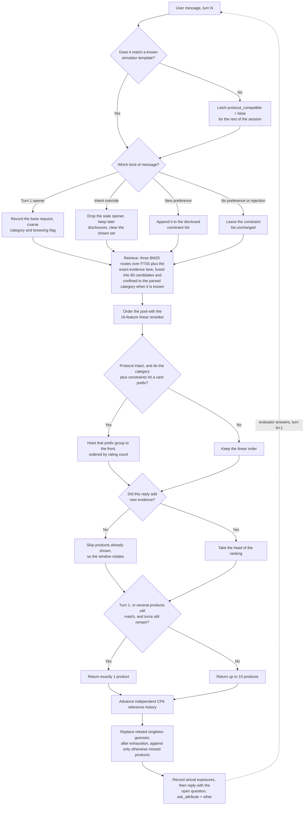

# TechJam Conversational E-Commerce Search — Team Solution

A fully offline, standard-library conversational shopping agent that finds the
customer's hidden target product among 50,000 catalog items. On the released
200-session public set it scores:

| HitRate@10 | MRR | MTTC | TechnicalScore |
|---:|---:|---:|---:|
| **1.000** | **1.000** | **2.07** | **0.9786** |

Every session finds its target, always at rank 1 in the returned list, in
about two turns on average — with no LLM, no network access, no API keys, no
GPU, and zero reported token usage at inference time. The complete experiment
history through CP6 is in [`EXPERIMENTS.md`](EXPERIMENTS.md). CP7 adds
protected exposure with a strict per-session regression gate; its design and
reproduction commands are in [the CP7 report](docs/cp7_protected_exposure.md).

## The Challenge

Build an AI shopping agent that asks useful follow-up questions and recommends
the customer's hidden target product within at most 10 turns.

- A frozen catalog of 50,000 products from the `Clothing_Shoes_and_Jewelry`
  category of Amazon Reviews 2023.
- 200 labeled public sessions for local development; the organizer keeps 800
  additional sessions unreleased until the submission deadline.
- Sessions cover Buying, Browsing, Intent Override, and Boundary behavior.
- On every turn the agent may ask a clarification question (`message` +
  `ask_attribute`), return a ranked list of up to 10 catalog `parent_asin`
  values, or both. The session ends when the target appears in the scored
  Top 10 or after turn 10.

Scoring:

```text
TechnicalScore = 0.50 × HitRate@10 + 0.30 × MRR + 0.20 × Efficiency
Efficiency     = clip((11 − MTTC) / 10, 0, 1)
```

Only exact `parent_asin` equality produces a hit; a miss contributes zero MRR
and is assigned turn 11 for MTTC. See
[`docs/competition_specification.md`](docs/competition_specification.md) and
[`docs/final_evaluation_faq.md`](docs/final_evaluation_faq.md) for the full
rules, and [`docs/submission_rules.md`](docs/submission_rules.md) for the
submission policy.

## Our Solution

The agent (in `starter/`) is a layered retrieval funnel with
confidence-qualified output and a protected exposure policy. All indexes are built once at startup from
`data/catalog.jsonl` alone; runtime code never reads targets, labels, or
evaluator internals.

The diagram shows the retained CP6 reference policy plus the CP7 output layer.



1. **Conversation state and intent classification.** A deterministic
   classifier tracks the base request, separately disclosed hard constraints,
   boundary replies, already shown product IDs, and intent overrides. An
   override removes the stale opening preference (and resets shown-ID
   coverage) while preserving later valid disclosures.
2. **Category-scoped lexical retrieval.** The opening message's coarse
   category is parsed, validated against the catalog's category vocabulary,
   and applied as an exact structural constraint inside every SQLite FTS5
   route. Three field-weighted BM25 routes — conjunctive terms, adjacent
   phrases, and disjunctive terms — are fused with weighted reciprocal-rank
   fusion. If the category is unrecognized or a scoped search comes back
   empty, retrieval fails open to the global routes.
3. **Exact-evidence lane.** A second inverted index maps normalized
   feature/detail values, semicolon fragments, and material/color aliases to
   product IDs, so constraints quoted verbatim from the catalog act as a
   precision lane alongside BM25. The union is capped at 80 candidates.
4. **Learned linear reranking.** A 16-feature pairwise logistic model
   (retrieval rank, per-field token coverage, exact-evidence coverage and
   rarity, material/color/budget compatibility, popularity–intent
   interactions) orders the pool. Only the numeric weights are committed
   (`starter/reranker_weights.json`); training used a target-blind 150/50
   public split with five-fold cross-validation.
5. **Ordered dialogue-card matching.** For every catalog item the agent
   reconstructs the short, ordered evidence card a user could disclose about
   it — coarse category, material, color, then normalized feature/detail
   fragments — and indexes every `(category, ordered-prefix)`. Observed
   constraints in arrival order form a prefix key whose lookup is global, so a
   correct product is recovered even if BM25 missed it. Matches are ordered by
   log rating-count popularity with deterministic ASIN tie-breaking.
6. **Confidence-qualified output (abstention).** While an exact prefix still
   maps to more than one product, the agent returns a single candidate instead
   of ten low-confidence guesses, and asks an open clarification question. A
   hit is therefore rank 1; a miss earns another disclosure. When the evidence
   becomes unique, full Top-K output resumes; on turn 10 abstention is
   disabled and the full rotated window is returned because no later
   clarification is possible.
7. **Coverage rotation.** When a reply adds no new evidence, the preceding
   recommendations are known to be wrong, so previously shown candidates
   rotate out and the next unseen ranked products are exposed.
8. **Protocol guard and fallbacks.** The card path activates only for
   recognized dialogue templates; free-form or drifted wording falls back to
   the general lexical funnel (steps 2–4). A fine-tuned TinyBERT cross-encoder
   from an earlier checkpoint was disabled after ablations showed no remaining
   effect, and has since been removed from `main` entirely (the model, its
   training pipeline, and runtime wrapper are preserved on the
   `sri-experiment-cp4` branch).

9. **Protected exposure (CP7).** Keep CP6’s reference history independent of
   actual recommendations. Replace only proven-wrong singleton guesses, and
   remove confirmed misses before final-turn backfilling. After explicit
   exhaustion, spare positions may expose matching products absent from every
   future CP6 and singleton-only slate. Pre-override exposures never establish
   misses; unsupported wording disables this layer. The auxiliary matching
   cohort has no 80-product cap and deduplicates normalized observations.

### Results by scenario (public 200)

| Scenario | Sessions | HitRate@10 | MRR | MTTC |
|---|---:|---:|---:|---:|
| Buying | 80 | 1.0 | 1.0 | 1.525 |
| Browsing | 80 | 1.0 | 1.0 | 1.9375 |
| Intent Override | 30 | 1.0 | 1.0 | 3.73 |
| Boundary | 10 | 1.0 | 1.0 | 2.50 |

### How we got here

Seven evaluated checkpoints with holdout and target-disjoint validation
([CP1–CP6 ledger](EXPERIMENTS.md), [CP7 report](docs/cp7_protected_exposure.md)):

| Checkpoint | Key change | TechnicalScore |
|---|---|---:|
| Starter | Weak BM25 baseline | 0.106710 |
| CP1 | Stateful multi-route lexical retrieval + intent-adaptive popularity | 0.835830 |
| CP2 | Learned 14-feature pairwise reranker (target-blind split) | 0.912340 |
| CP3 | Exact-evidence funnel, 16-feature reranker, coverage rotation | 0.932620 |
| CP4 | Intent-gated fine-tuned TinyBERT cross-encoder | 0.933320 |
| CP5 | Ordered dialogue cards + Top-1 abstention under ambiguity | 0.977200 |
| CP6 | Exact category-scoped retrieval (after a 15-repository audit) | 0.978000 |
| CP7 | Protected singleton replacement and exhausted-cohort coverage | **0.978600** |

Every change that lowered the score was reverted and recorded, including
dense retrieval, wider candidate pools, per-mode ranking heads, fixed-turn
release policies, and average-rating priors. Validation discipline: tuning
only on a 150-session development partition, one-shot aggregate-only holdout
checks after freezing each configuration, and seeded synthetic session sets
whose targets are disjoint from all 200 public targets. CP7 additionally requires
zero per-session regressions in hit status, reciprocal rank, and first-hit turn;
aggregate improvements cannot compensate for a worse individual case.

### Model choice, cost, and feasibility

No LLM or external model is used at inference. The runtime is Python standard
library plus SQLite FTS5; NumPy/scikit-learn (and PyTorch for the CP4-era
cross-encoder experiment, preserved on the `sri-experiment-cp4` branch) were
used offline for training only.

- Estimated API cost: $0.00; reported tokens: 0 prompt / 0 completion.
- No network, credentials, vector database, or GPU required.
- On the development machine, the full public run builds all indexes in about
  44 seconds (one-time, amortizable in a service) and evaluates 200 sessions
  in about 44 seconds.

## Setup and Reproducing Our Results

Python 3.10 or later is the only requirement — the runtime has no third-party
dependencies, so there is nothing to `pip install` for the submitted agent.

**1. Get the catalog.** Download `catalog.jsonl.gz` from the GitHub Release
attached to this repository (verify against the published `SHA256SUMS`), then:

```bash
gzip -dk catalog.jsonl.gz
mv catalog.jsonl data/catalog.jsonl
```

**2. Run the official evaluator.**

```bash
python3 -m evaluator.local_evaluator
```

This runs all 200 public sessions against the agent in `starter/agent.py` and
writes per-session results and aggregate metrics to `results.json`. The run is
deterministic; the aggregates should reproduce the headline result exactly:
`hit_rate_at_10: 1.0`, `mrr: 1.0`, `mttc: 2.07`,
`recommended_technical_score: 0.9786`. Do not edit the evaluator or public
labels when reporting a local score.

**3. Run the tests.**

```bash
python3 -m unittest discover tests
```

To reproduce any intermediate checkpoint or ablation rather than the final
agent, every experiment in [`EXPERIMENTS.md`](EXPERIMENTS.md) lists its
branch, configuration, and exact commands (variant runners live under
`scripts/`, e.g. `python3 -m scripts.evaluate_cp6_variant full`).

**Optional — synthetic validation.** Larger target-disjoint session sets
(deterministic seeds, official scenario mix) can be generated and evaluated
through the real evaluator loop; the hard-case set stresses common-attribute,
dense-neighborhood targets, and an unofficial paraphrase harness measures
wording robustness. See [`README_DEV.md`](README_DEV.md) for the full
workflow:

```bash
python3 -m scripts.create_cp4_synthetic_sets     # 3000/1000/1000 train/dev/holdout
python3 -m scripts.create_cp4_hardcase_set       # 500 hard targets
python3 -m scripts.evaluate_cp4_confirm --dataset data/releases/cp4/synthetic_dev.jsonl
python3 -m tests.paraphrase_harness --limit 25   # UNOFFICIAL diagnostic
```

**Optional — retraining.** Reranker training scripts are under `scripts/`
(`train_cp2_reranker.py`, `train_cp3_reranker.py`); they require
NumPy/scikit-learn but are never needed at runtime. The CP4 cross-encoder
fine-tuning pipeline lives on the `sri-experiment-cp4` branch.

## Agent Interface

```python
class Agent:
    def reset(self, session_id: str, user_profile: dict) -> None:
        ...

    def respond(self, session_id: str, user_message: str, turn: int, top_k: int) -> dict:
        return {
            "message": "Do you have a material preference?",
            "ask_attribute": "material",
            "recommendations": [
                {"parent_asin": "B000..."},
                {"parent_asin": "B001..."}
            ],
            "usage": {"prompt_tokens": 120, "completion_tokens": 30}
        }
```

`ask_attribute` is one of `category`, `material`, `color`, `size`, `style`,
`brand`, `budget`, `feature`, `use_case`, `other`, or `null`. See
[`docs/agent_api_contract.json`](docs/agent_api_contract.json).

## Repository Layout

```text
starter/                          the agent: orchestrator, dialogue cards, reranker weights
evaluator/local_evaluator.py      official public-set simulator and scorer (unmodified)
data/public_set.jsonl             200 labeled development sessions
data/cp2_split.json               target-blind 150 dev / 50 holdout manifest
scripts/                          experiment drivers, synthetic-set generators, trainers
tests/                            unit tests and the unofficial paraphrase harness
EXPERIMENTS.md                    consolidated CP1–CP6 + unmerged-branch experiment ledger
README_DEV.md                     synthetic test-case workflow
docs/                             competition spec, FAQ, API contract, scoring config
docs/baseline_results.json        weak-starter reference (HR 0.125, MRR 0.068, MTTC 9.81)
```

## Limitations and What We Would Improve

Honest caveats first: the headline numbers are as high as they are partly
because the released simulator is deterministic, and our strongest mechanism
leans on that.

- **Protocol specialization.** The dialogue-card path reconstructs the exact
  ordered evidence template the released simulator uses. The guard means
  unrecognized wording degrades gracefully to the lexical funnel instead of
  breaking, but on drifted phrasing performance falls toward the CP3/CP4 level
  (roughly 0.93) rather than 0.978. Our unofficial paraphrase harness measures
  this gap directly; closing it further was the main unfinished robustness
  work.
- **Lexical, not semantic.** Exact-evidence matching cannot recover a
  constraint whose own tokens are reworded (say, "crimson" for a catalog value
  of "red"). Dense retrieval and a fine-tuned cross-encoder were both built
  and measured, and both lost to exact matching *on this protocol* — but on a
  noisier real-user conversation that trade-off could reverse, and we would revisit the
  neural fallback first.
- **Irreducible ties.** Products can share every disclosable card value, so
  no additional question can distinguish them once the card is exhausted.
  CP7 improves coverage by using spare positions for products the protected
  policies would otherwise miss. Some large ties still exceed the ten-turn
  budget; the policy preserves existing successes instead of trading away
  their reciprocal rank to maximize aggregate expected score.
- **Cold start.** Building the FTS5, exact-value, card, and category indexes
  takes about 44 seconds. Fine for a one-shot evaluation, but a service
  deployment should serialize the prebuilt indexes instead of rebuilding them
  at startup.
- **Unmerged robustness work.** A parallel branch (`arjo-cp4`/`arjo-cp5`, see
  [`EXPERIMENTS.md`](EXPERIMENTS.md)) hardened wording coverage — wider
  override/no-preference/budget vocabularies and an index-gated n-gram
  constraint fallback — and scored identically on the clean public set with a
  measurably smaller paraphrase gap. Given more time we would unify those
  parsers with the mainline agent rather than maintaining two lines.

## Data Source

The catalog and sessions are derived from Amazon Reviews 2023 by McAuley Lab,
UCSD. See [`DATA_ATTRIBUTION.md`](DATA_ATTRIBUTION.md) before using or
redistributing the data. Sessions are sampled deterministically from the
official Clothing 5-core leave-last-out split and joined to the frozen
catalog.
