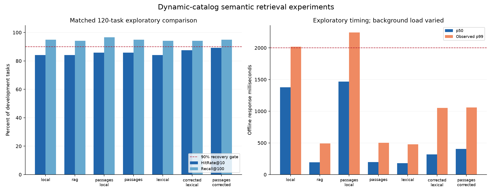

# Extension results

This report separates observed measurements from incomplete release gates.

## Official compatibility

Public: HitRate@10 **1.0**, MRR **1.0**, MTTC **2.1**, TechnicalScore **0.978**. Model calls: 0.

## Catalog growth

| Added total | Incremental batch | Full rebuild | Sampled ranking differences |
|---:|---:|---:|---:|
| 1,000 | 1.90 s | 38.09 s | 0/135 |
| 5,000 | 10.66 s | 47.85 s | 0/142 |
| 10,000 | 11.46 s | 47.51 s | 0/150 |

Restart recovery: **True**. Duplicate events idempotent: **True**. Stale events rejected: **True**.

The first sustained unbatched stream fell behind at 10 and 100 events/s. Its backlog is retained. The original final comparison had three tied-order differences with identical candidate sets; deterministic extended-route ordering is checked separately.

Deterministic extended lexical parity: **0 differences across 100 queries**.

## Exploratory development screen

Fixed 120-task development subset. Accuracy screens ran alongside other work, so their latency is not production qualification. Early screens also preceded final simulator exposure fixes.

| Variant | HitRate@10 | Recall@100, any observed turn |
|---|---:|---:|
| gated-tinybert | 84.17% | 94.17% |
| graph | 64.17% | 88.33% |
| hybrid | 66.67% | 91.67% |
| learned | 66.67% | 91.67% |
| lexical | 65.83% | 93.33% |
| main | 58.33% | 91.67% |
| minilm-cross | 75.00% | 91.67% |
| residual | 75.00% | 91.67% |
| rules | 65.83% | 94.17% |
| tinybert-100 | 80.83% | 91.67% |
| tinybert-lexical | 84.17% | 94.17% |
| tinybert | 75.00% | 91.67% |

## Semantic preprocessing and request parsing

Matched 120-task development ablations. Whole-product embeddings versus source-passage embeddings, with and without local Qwen request normalization before retrieval.

| Variant | HitRate@10 | Recall@100 | p99 observed, ms |
|---|---:|---:|---:|
| corrected-lexical | 87.50% | 94.17% | 1054 |
| rag-local | 84.17% | 95.00% | 2018 |
| rag | 84.17% | 94.17% | 490 |
| rag-passages-corrected | 89.17% | 95.00% | 1060 |
| rag-passages-local | 85.83% | 96.67% | 2242 |
| rag-passages | 85.83% | 95.00% | 502 |
| tinybert-lexical | 84.17% | 94.17% | 477 |

These are small offline screens; background CPU load varied during follow-up state tests. Queueing and production tail qualification remain separate.

The corrected variants replace only the explicitly scoped earlier requirement, preserving unrelated preferences. Compare corrected lexical with corrected passage retrieval to isolate the embedding contribution. No encoder weights are retrained. Passage text is hashed and cached; updates encode only missing texts. The initial passage implementation repacked stored vectors after publication. The subsequent storage optimization retains a base matrix, mutable delta matrix and deletion masks; explicit compaction merges stored vectors without encoding. Search still scans stored vectors, so query cost grows with catalog size.

| Variant | Paired recovery gain vs lexical | Bootstrap 95% interval | Parser failures / calls |
|---|---:|---|---:|
| rag-local | +0.00% | -4.17% to +4.17% | 225/374 |
| rag | +0.00% | +0.00% to +0.00% | 0/0 |
| rag-passages-local | +1.67% | -2.50% to +5.83% | 235/369 |
| rag-passages | +1.67% | +0.00% to +4.17% | 0/0 |
| tinybert-lexical | +0.00% | +0.00% to +0.00% | 0/0 |
| corrected-lexical | +3.33% | +0.83% to +6.67% | 0/0 |
| rag-passages-corrected | +5.00% | +1.67% to +9.17% | 0/0 |

Intervals use paired resampling of development tasks; they do not establish sealed-test generalization.

## Incremental passage storage check

A real Amazon product absent from both evaluation catalogs required **2** new passage encodings and became ready in **0.349 s**. Source-evidence query HitRate@10: **True**. The existing base matrix was retained: **True**.

Deletion/reintroduction encodings: **0/0**. Compaction encodings: **0**; sampled retrieval unchanged: **True**. This is a single-product engineering probe, not a population reachability estimate.

## Dataset audit

AI review produced 200 valid verdicts for 200 stratified development examples. It flagged **31** possible unsupported additions, **1** possible product-type changes, and **9** examples of non-customer wording. Categories may overlap. Flags are retained and are not silently excluded from accuracy denominators.

The reviewer uses the same model family as generation; correlated errors and incorrect audit flags are possible. This is not human validation.

## API deadline screen

Twelve requests per available provider/mode; exploratory, not a p99 claim. Unknown timeout charges retain their full budget reservations.

| Provider | Task | Calls | Failures |
|---|---|---:|---:|
| openai-nano | ranking | 12 | 11 |
| openai-nano | extraction | 12 | 1 |
| openai-luna | ranking | 12 | 10 |
| openai-luna | extraction | 12 | 10 |
| gemini-lite | ranking | 1 | 1 |
| gemini-lite | extraction | 1 | 1 |

Current charged-or-reserved budget: **$0.1058 / $10**. Gemini returned HTTP 404; no more expensive model was substituted.

## Release status

LightRAG pilot status: **infeasible_external_gate**.
Pending: sealed generalization, isolated load confirmation.

No claim is made that the combined quality, latency, and compatibility release gates have passed. Raw datasets, source records, traces, event streams, and measurements remain in `data/releases/extension-v1/`. Reproduction commands are in `extension/README.md`.
