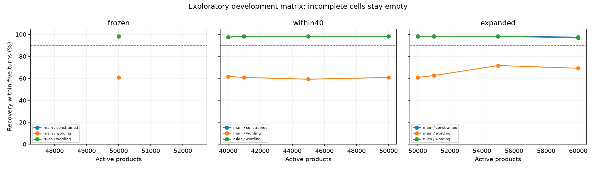
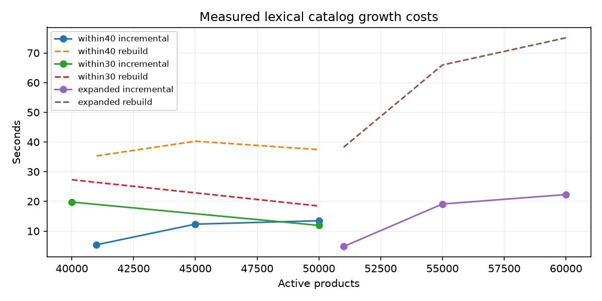

# Query language × catalog growth

Controlled evaluator-derived experiments. Results outside the public frozen-50k run are experimental.

## Official compatibility

- main: TechnicalScore 0.978, model calls 0, passed True.
- rules: TechnicalScore 0.978, model calls 0, passed True.
- qwen: TechnicalScore 0.978, model calls 0, passed True.

## Catalog checkpoints

| Schedule | Products | Added | Update seconds | Rebuild seconds | Conversation mismatches |
|---|---:|---:|---:|---:|---:|
| expanded | 50000 | 0 | 0.000 | 33.251 | 0 |
| expanded | 51000 | 1000 | 4.781 | 38.243 | 0 |
| expanded | 55000 | 4000 | 19.108 | 65.952 | 0 |
| expanded | 60000 | 5000 | 22.301 | 75.112 | 0 |
| frozen | 50000 | 0 | 0.000 | 46.632 | 0 |
| within30 | 30000 | 0 | 0.000 | 22.433 | 0 |
| within30 | 40000 | 10000 | 19.769 | 27.290 | 0 |
| within30 | 50000 | 10000 | 11.903 | 18.433 | 0 |
| within40 | 40000 | 0 | 0.000 | 33.935 | 0 |
| within40 | 41000 | 1000 | 42.519 → 5.381 optimized | 27.870 | 0 |
| within40 | 45000 | 4000 | unmeasured after interruption → 12.325 optimized | 37.565 | 0 |
| within40 | 50000 | 5000 | 13.485 | 37.432 | 0 |

Zero-addition rows describe initial checkpoints; their update column is not initial preprocessing time. Startup and clean-cache embedding work are recorded separately.

## Query comparisons

All measured query runs, including historical screens

| Catalog | Size | Language | Variant | Split / phase / mode | Seed | Tasks | Hit10 by 5 | Recall100 by 5 | MRR | MTTC |
|---|---:|---|---|---|---:|---:|---:|---:|---:|---:|
| expanded | 50000 | constrained | main | dev / screen-v2 / interactive | 20260910 | 120 | 98.33% | 98.33% | 0.9917 | 3.125 |
| expanded | 50000 | wording | main | dev / screen-v2 / interactive | 20260910 | 120 | 60.83% | 95.00% | 0.3068 | 4.875 |
| expanded | 50000 | wording | rules | dev / screen-v2 / interactive | 20260910 | 120 | 98.33% | 98.33% | 0.9461 | 3.075 |
| expanded | 51000 | constrained | main | dev / screen-v2 / interactive | 20260910 | 120 | 98.33% | 98.33% | 0.9917 | 3.033333 |
| expanded | 51000 | wording | main | dev / screen-v2 / interactive | 20260910 | 120 | 62.50% | 95.00% | 0.3197 | 4.766667 |
| expanded | 51000 | wording | rules | dev / screen-v2 / interactive | 20260910 | 120 | 98.33% | 98.33% | 0.9475 | 2.983333 |
| expanded | 55000 | constrained | main | dev / screen-v2 / interactive | 20260910 | 120 | 98.33% | 98.33% | 0.9833 | 2.841667 |
| expanded | 55000 | wording | main | dev / screen-v2 / interactive | 20260910 | 120 | 71.67% | 97.50% | 0.4159 | 4.041667 |
| expanded | 55000 | wording | rules | dev / screen-v2 / interactive | 20260910 | 120 | 98.33% | 99.17% | 0.8957 | 2.816667 |
| expanded | 60000 | constrained | main | dev / screen-v2 / interactive | 20260910 | 120 | 97.50% | 98.33% | 0.9833 | 2.925 |
| expanded | 60000 | wording | main | dev / screen-v2 / interactive | 20260910 | 120 | 69.17% | 97.50% | 0.3538 | 4.183333 |
| expanded | 60000 | wording | rules | dev / screen-v2 / interactive | 20260910 | 120 | 96.67% | 99.17% | 0.8645 | 2.941667 |
| frozen | 50000 | constrained | main | dev / screen-v2 / interactive | 20260910 | 120 | 98.33% | 98.33% | 0.9917 | 3.125 |
| frozen | 50000 | wording | main | dev / screen-v2 / interactive | 20260910 | 120 | 60.83% | 95.00% | 0.3068 | 4.875 |
| frozen | 50000 | wording | rules | dev / screen-v2 / interactive | 20260910 | 120 | 98.33% | 98.33% | 0.9461 | 3.075 |
| frozen | 50000 | wording | rules | dev / screen / interactive | 20260910 | 120 | 73.33% | 91.67% | 0.4906 | 4.625 |
| within30 | 30000 | constrained | main | dev / screen-v2 / interactive | 20260910 | 120 | 93.33% | 97.50% | 0.9583 | 3.433333 |
| within30 | 30000 | wording | main | dev / screen-v2 / interactive | 20260910 | 120 | 57.50% | 93.33% | 0.3106 | 5.066667 |
| within30 | 30000 | wording | rules | dev / screen-v2 / interactive | 20260910 | 120 | 93.33% | 97.50% | 0.9051 | 3.391667 |
| within30 | 40000 | constrained | main | dev / screen-v2 / interactive | 20260910 | 120 | 97.50% | 98.33% | 0.9833 | 3.125 |
| within30 | 40000 | wording | main | dev / screen-v2 / interactive | 20260910 | 120 | 61.67% | 92.50% | 0.2944 | 4.941667 |
| within30 | 40000 | wording | rules | dev / screen-v2 / interactive | 20260910 | 120 | 97.50% | 98.33% | 0.9245 | 3.1 |
| within30 | 50000 | constrained | main | dev / screen-v2 / interactive | 20260910 | 120 | 98.33% | 98.33% | 0.9917 | 3.125 |
| within30 | 50000 | wording | main | dev / screen-v2 / interactive | 20260910 | 120 | 60.83% | 95.00% | 0.3068 | 4.875 |
| within30 | 50000 | wording | rules | dev / screen-v2 / interactive | 20260910 | 120 | 98.33% | 98.33% | 0.9461 | 3.075 |
| within40 | 40000 | constrained | main | dev / screen-v2 / interactive | 20260910 | 120 | 97.50% | 98.33% | 0.9833 | 3.125 |
| within40 | 40000 | wording | main | dev / screen-v2 / interactive | 20260910 | 120 | 61.67% | 92.50% | 0.2944 | 4.941667 |
| within40 | 40000 | wording | rules | dev / screen-v2 / interactive | 20260910 | 120 | 97.50% | 98.33% | 0.9245 | 3.1 |
| within40 | 41000 | constrained | main | dev / screen-v2 / interactive | 20260910 | 120 | 98.33% | 98.33% | 0.9833 | 3.108333 |
| within40 | 41000 | wording | main | dev / screen-v2 / interactive | 20260910 | 120 | 60.83% | 92.50% | 0.3000 | 4.883333 |
| within40 | 41000 | wording | rules | dev / screen-v2 / interactive | 20260910 | 120 | 98.33% | 98.33% | 0.9258 | 3.075 |
| within40 | 45000 | constrained | main | dev / screen-v2 / interactive | 20260910 | 120 | 98.33% | 98.33% | 0.9833 | 3.175 |
| within40 | 45000 | wording | main | dev / screen-v2 / interactive | 20260910 | 120 | 59.17% | 93.33% | 0.3088 | 4.95 |
| within40 | 45000 | wording | rules | dev / screen-v2 / interactive | 20260910 | 120 | 98.33% | 98.33% | 0.9320 | 3.141667 |
| within40 | 50000 | constrained | main | dev / screen-v2 / interactive | 20260910 | 120 | 98.33% | 98.33% | 0.9917 | 3.125 |
| within40 | 50000 | wording | main | dev / screen-v2 / interactive | 20260910 | 120 | 60.83% | 95.00% | 0.3068 | 4.875 |
| within40 | 50000 | wording | rules | dev / screen-v2 / interactive | 20260910 | 120 | 98.33% | 98.33% | 0.9461 | 3.075 |

## Interpretation and outstanding evidence

Three seeds reuse product tasks and are not independent samples. Paired confidence intervals cluster by product. Semantic generation fallbacks and AI audit flags remain in the denominator. Existing broad-campaign results are historical, not measurements of this matrix.

- Semantic paraphrase bank: recorded; inspect artifact gates.
- 200-example equivalence audit: recorded; inspect artifact gates.
- Frozen finalists: pending.
- Sealed paired comparison: pending.
- Load confirmation: pending.

## Retained translation examples

- Input: Can you find Keyrings Keychains & Charms? I prefer Closure Type: Pull On.
  Normalized: I'm looking for keyrings keychains & charms. closure type: pull on
- Input: What I care about is Pull On closure; Material: alloy.
  Normalized: For that, what matters is: pull on closure; material: alloy.
- Input: My preferences are Theme: Anime; Closure Type: Pull On.
  Normalized: For that, what matters is: theme: anime; closure type: pull on.

No combined quality/latency release claim is made without completed gate evidence.

